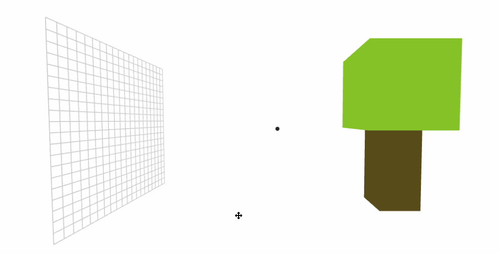
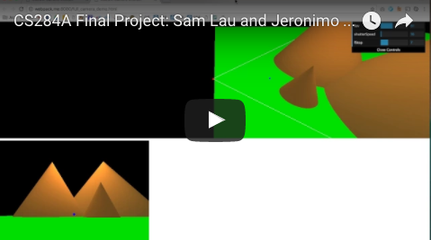

Camera Interact
=====================

This little web demo explains how cameras work using animations. We explain
how cameras record images, why cameras need an aperture, why cameras have
lenses, and how the field of view and depth of field is adjusted in a camera.

Here's the intro video for project:

This web app was created as a final project for Berkeley's Computer Graphics
class, [CS284A][284].

[284]: https://cs184.org/
